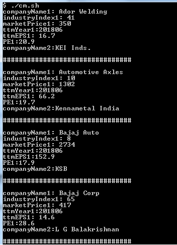

# PDF To Text
This depends upon pdftotext (v0.14.5) from  poppler-utils ( http://poppler.freedesktop.org).
Please install poppler-utils before testing.

This has been tested on a Linux box. But you should be able to run it
on a MINGW32 shell/bash Windows environment as well (but you will need
to make adjustments for CRLF on Windows environment when making outputs). 

Alternatively, simply echo to terminal.

